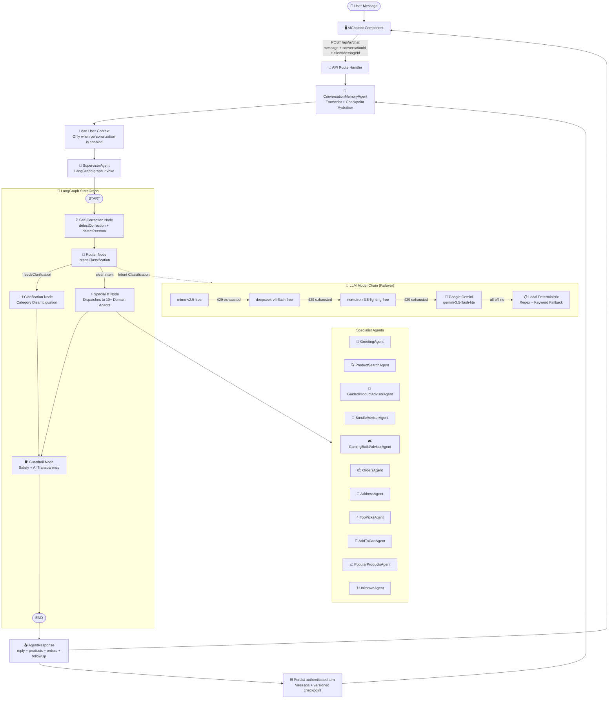
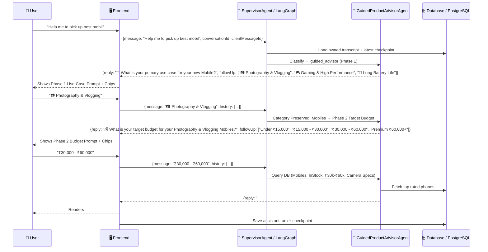

# 🤖 Agentic AI Architecture — ShopNow E-Commerce

## Overview

ShopNow implements a **LangGraph StateGraph-powered, multi-agent conversational AI** system that provides responsible, multi-turn shopping assistance. The system features:

- **LangGraph StateGraph orchestration** (`@langchain/langgraph` v1.4.x) — replacing the legacy hand-rolled `AgentGraph`/`GraphRunner` with typed state channels, conditional edges, and durable PostgresSaver checkpointing.
- **LangChain Google GenAI integration** (`@langchain/google-genai`) — wrapping Google Gemini via `ChatGoogleGenerativeAI` for native tool-calling and streaming readiness.
- **Multi-model free-tier rotation** — OpenCode models (`mimo-v2.5-free` → `deepseek-v4-flash-free` → `nemotron-3.5-lighting-free`) are tried in sequence; quota-exhausted models are automatically skipped before falling back to Google Gemini.
- **Authenticated conversation memory and checkpoint agent** — persistent transcript, versioned checkpoints, and deduplication via `clientMessageId`.
- **Adaptive Self-Correction & Error Recovery** — detects user corrections across budget, brand, and category dimensions with empathetic acknowledgment.
- **Multi-Turn Guided Product Advisor Engine** — 3-phase consultation for Mobiles, Laptops, Audio, Cameras, TV, and Tablets.
- **Responsible AI guardrails** — catalog-grounded recommendations, empty response recovery, and AI transparency disclosures.
- **Full 8-component deterministic PC Builder** — compatible gaming rigs with brand discovery, inline coupon calculations, and post-build swaps.

---

## System Flow (LangGraph)



---

## Multi-Turn Conversation & Self-Correction Flow



---

## Agent Architecture

### Directory Structure

```
artifacts/api-server/src/agents/
├── index.ts                         # Barrel exports (agents + LangGraph)
├── types.ts                         # Shared interfaces
├── ai-provider.ts                   # 🧠 Multi-model AI provider with failover chain
├── supervisor-agent.ts              # 🧠 Orchestrates via LangGraph graph.invoke()
├── conversation-memory-agent.ts     # 🧠 Authenticated transcript and checkpoint persistence
├── self-correction-engine.ts        # 💡 Detects user corrections & generates empathetic prefixes
├── router-agent.ts                  # Intent classification + active conversation persistence
├── guided-product-advisor-agent.ts  # 📱 3-Phase Multi-Turn Guided Advisor
├── clarification-policy.ts          # Stops vague budget-only catalog searches
├── gaming-build-advisor-agent.ts    # 🎮 8-Component PC Build advisor
├── guardrail-agent.ts               # Validates final frontend response contract
├── user-context.ts                  # Loads user profile from DB
├── greeting-agent.ts                # 👋 Welcome + personalization
├── product-search-agent.ts          # 🔍 Cascading product search
├── bundle-advisor-agent.ts          # 🎁 Profession-based bundle recommendations
├── top-picks-agent.ts               # ⭐ History-based recommendations
├── popular-products-agent.ts        # 📈 Trending products
├── orders-agent.ts                  # 📦 Order history (login-gated)
├── address-agent.ts                 # 📍 Shipping address (login-gated)
├── add-to-cart-agent.ts             # 🛒 Single + bulk add via conversation
├── compare-agent.ts                 # ⚖️ Product comparison
├── unknown-agent.ts                 # ❓ Fallback + suggestions
├── privacy-guard.ts                 # 🔒 PII redaction
└── langgraph/                       # 🔀 LangGraph Integration
    ├── index.ts                     #   Barrel exports
    ├── state.ts                     #   Annotation.Root typed state channels
    ├── graph.ts                     #   StateGraph builder + PostgresSaver checkpointer
    ├── langchain-provider.ts        #   ChatGoogleGenerativeAI factory
    └── nodes/
        ├── self-correction-node.ts  #   Correction detection + persona classification
        ├── router-node.ts           #   Intent classification with clarification policy
        ├── clarification-node.ts    #   Category disambiguation
        ├── specialist-node.ts       #   Agent dispatch (10+ specialists)
        └── guardrail-node.ts        #   Safety validation + AI transparency
```

Conversation persistence is defined in `lib/db/src/schema/conversations.ts`:

- `chat_conversations` stores the authenticated owner and personalization setting.
- `chat_messages` stores ordered user/assistant turns and retry IDs.
- `chat_checkpoints` stores versioned advisor state for guided-flow recovery.

---

## LangGraph StateGraph Architecture

### State Schema (`Annotation.Root`)

The typed state channels in `state.ts` define the data flowing through the graph:

| Channel | Type | Reducer | Purpose |
|---|---|---|---|
| `message` | `string` | replace | Current user message |
| `userId` | `number \| null` | replace | Authenticated user ID |
| `userContext` | `UserContext` | replace | Orders, interests, brands |
| `history` | `Array<{role, content}>` | **append** | Conversation transcript |
| `parsedIntent` | `ParsedIntent \| null` | replace | Router classification result |
| `checkpoint` | `ConversationCheckpoint \| null` | replace | Business state (persona, advisor, budget) |
| `currentAgent` | `string` | replace | Selected specialist agent key |
| `agentResponse` | `AgentResponse \| null` | replace | Specialist output |
| `correctionDetected` | `boolean` | replace | Self-correction flag |
| `correctionType` | `string \| null` | replace | `budget` / `brand` / `category` / `general` |
| `persona` | `string \| null` | replace | `parent` / `student` / `gamer` / `professional` / `gift_buyer` |
| `needsClarification` | `boolean` | replace | Whether to route to clarification |
| `isComplete` | `boolean` | replace | Terminal flag |

### Graph Topology

```
START → self_correction → router
   ├── [needsClarification=true]  → clarification → guardrail → END
   └── [needsClarification=false] → specialist    → guardrail → END
```

### Checkpointing

- **Primary**: `PostgresSaver` (backed by `DATABASE_URL` — durable across restarts)
- **Fallback**: `MemorySaver` (in-memory, used when Postgres unavailable)
- **Thread ID**: `user-{userId}` for authenticated sessions, `anon-{timestamp}` for anonymous

---

## Multi-Model Free-Tier Rotation (AI Provider)

### How It Works

The "free rate limit exhausted" error (HTTP 429 / `FreeUsageLimitError`) means the **API key's per-model free quota** is used up — not the model itself going offline. Each free-tier model on OpenCode has its own independent quota pool.

The `OpenCodeProvider` implements an ordered model chain:


### Model Chain Configuration

| Priority | Model | Provider | Type |
|---|---|---|---|
| 1 | `mimo-v2.5-free` | OpenCode | Free tier |
| 2 | `mimo-v2-pro-free` | OpenCode | Free tier |
| 3 | `nemotron-3-super-free` | OpenCode | Free tier |
| 4 | `minimax-m2.5-free` | OpenCode | Free tier |
| 5 | `deepseek-v4-flash-free` | OpenCode | Free tier |
| 6 | `big-pickle` | OpenCode | Free tier |
| 7 | `gpt-5-nano` | OpenCode | Free tier |
| 8 | `gemini-3.5-flash-lite` | Google | API key |
| 9 | Local fallback | Built-in | Deterministic regex/keyword |

### Rate Limit Detection

A response is classified as quota-exhausted when any of these conditions match:
- HTTP status `429`
- Body contains: `rate limit`, `FreeUsageLimitError`, `quota`, `resource_exhausted`

### Diagnostic Endpoint

`GET /api/ai/quota-status` returns real-time status of all providers and models:

```json
{
  "status": "available",
  "canUseModel": true,
  "isLimitExhausted": false,
  "activeProvider": "opencode",
  "activeModel": "deepseek-v4-flash-free",
  "orchestrator": "LangGraph (StateGraph) + @langchain/google-genai",
  "providers": {
    "google": { "configured": true, "status": "available", "model": "gemini-3.5-flash-lite" },
    "opencode": {
      "configured": true,
      "status": "available",
      "model": "deepseek-v4-flash-free",
      "modelChain": ["mimo-v2.5-free", "deepseek-v4-flash-free", "nemotron-3.5-lighting-free"]
    }
  }
}
```

---

## Core Agent Capabilities

### 📱 Guided Product Advisor Engine (`guided-product-advisor-agent.ts`)

- **Multi-Category Guided Consultation**: Supports **Mobiles**, **Laptops**, **Audio/Headphones**, **Cameras**, **TV & Smart Displays**, **Tablets**, and **Accessories**.
- **Phase-by-Phase Interactive Questioning**:
  - **Phase 1 (Primary Use Case)**: e.g. `📷 Photography & Vlogging`, `🎮 Gaming & High Performance`, `🔋 Long Battery Life`, `💼 Business & Office Work`, `🎬 Movies & Streaming` (TVs), `🎨 Digital Art & Drawing` (Tablets).
  - **Phase 2 (Target Budget & Brand Filters)**: e.g. `Under ₹15,000`, `₹15,000 - ₹30,000`, `₹30,000 - ₹60,000`, `Premium ₹60,000+`.
  - **Phase 3 (Precision Match & #1 Single Best Product)**: Ranks products by ratings & use-case specifications, presenting the **#1 Single Best Match** with an itemized recommendation rationale and top alternatives.
- **Out-of-Catalog Category Redirects**: TV and Tablet queries present friendly alternative guidance (Monitors, Laptops, Audio) instead of breaking.
- **Context Preservation**: Retains category and user choices across multi-turn chip selections without getting hijacked.

### 💡 Self-Correction & Error Recovery Engine (`self-correction-engine.ts`)

- **User Correction Detection**: Scans user input for correction patterns (`"no I meant"`, `"that's not what I asked"`, `"I already said"`, `"you misunderstood"`, `"wrong brand"`).
- **Correction Type Classification**: Detects `budget` (price/cost/under ₹X), `brand` (Samsung/Apple/etc), `category` (mobile/laptop/gaming), or `general` corrections.
- **Empathy & Learning**: Generates natural, apologetic acknowledgment prefixes (`"💡 Understood! My apologies for the brand mixup."`).
- **Empty Response Guard (guardrail-node.ts)**: Scans downstream agent outputs. If an agent returns 0 products or a blank response, injects contextual recovery guidance and rescue chips.
- **Fault Tolerance**: The SupervisorAgent wraps LangGraph `graph.invoke()` in error handling. If downstream APIs or LLM services fail, a self-healing fallback response is generated.

### 🎮 Human-Style Store Advisor PC Builder (`gaming-build-advisor-agent.ts` & `pc-builder.ts`)

- **5-Step Human Store Advisor Conversation Flow**:
  1. 💰 **Budget Selection**: Target total budget (`₹60,000`, `₹1,00,000`, `1.5 lakh`, `₹2,50,000`, `₹3,00,000`).
  2. 🎯 **Use Case / Workload**: `🎮 Pure Gaming & Esports`, `🎬 Video Editing & Content Creation`, `📡 Live Streaming & Gaming`, `💼 Heavy Workstation & CAD`.
  3. 🔵🔴 **Processor (CPU) Brand**: `🔵 Intel`, `🔴 AMD Ryzen`, `🤖 Let AI decide — best value for budget`.
  4. 🟢🔴 **Graphics Card (GPU) Brand**: `🟢 Nvidia RTX`, `🔴 AMD Radeon`, `🤖 Let AI decide — best FPS/₹`.
  5. 📺 **Target Monitor Resolution**: `⚡ 1080p High FPS (Esports)`, `🎯 1440p QHD High-Refresh`, `🌟 4K Ultra Gaming`, `🖥️ Multi-Monitor Workstation`.
- **Full 8-Component Rigs**: Recommends complete, compatible hardware configurations across **Processor**, **CPU Cooler**, **Graphics Card**, **RAM**, **Storage**, **Power Supply**, **Motherboard** (404 items in catalog), and **Case / Cabinet** (629 items in catalog).
- **Decimal & Multi-Format Budget Parser**: Converts inputs like `1.5 lakh`, `1.5L`, `150k`, `₹1,50,000`, `1.5` to ₹150,000.
- **Stockpile Brand Chooser**: Dynamically queries live in-stock brands (`ASUS`, `MSI`, `Gigabyte`, `Zotac`, `Corsair`, `Lian Li`, `NZXT`) and handles unstocked requests by providing a 1-tap brand discovery menu.
- **Inline Coupon Calculator**: Calculates exact promo code savings directly inside the PC build flow (`BUILD50K`, `GAMING10`, `CPU15`, `GPU5K`).
- **Post-Build Interactive Swaps**: Supports instant commands like `"Swap GPU to Nvidia"`, `"Swap CPU to Intel"`, `"Show cheaper build"`, `"Upgrade build"`.

### 🧭 Intent-Aware Router Agent (`router-agent.ts`)

- **Fast-Path Pattern Routing**:
  - `Compare`: Detects `vs`, `versus`, `compare X with Y` → direct comparison intent.
  - `Returns/Refunds`: Detects return/exchange requests → routes to `orders` agent with return instructions.
  - `Deals & Offers`: Routes flash sales and coupon requests to `popular_products`.
  - `PC Building vs Generic Gaming`: Strictly separates `"pc build"` / `"build a gaming pc"` from generic `"gaming laptops"` or `"gaming headset"`.
  - `Active Conversation Persistence`: Preserves ongoing multi-turn advisor sessions across CPU/GPU brand questions, budget steps, and confirmation flows.

### ❓ Dynamic Intent-Rescue Fallback (`unknown-agent.ts`)

- Analyzes unmatched messages to surface category-specific rescue chips (e.g. Return/Refund steps, Warranty info, Compare syntax, or TV/Tablet alternative redirects) instead of generic dead-ends.

### 📦 Order Tracking & Return Management (`orders-agent.ts`)

- **Order ID Extraction**: Automatically extracts `"order 123"` or `"order #45"` to fetch and format single order details.
- **Native Returns Handling**: Detects return/refund requests and lists delivered orders eligible for return with step-by-step guidance.

---

## 🧾 Order Details & Tax Invoice System (`/order/:id`, `/orders/:id`)

- **Line-Item Snapshots**: Joined `orderItemsTable` with `productsTable` returning product name, brand, category, thumbnail image, unit price, and quantity.
- **Live Shipment Stepper**: 4-stage tracking pipeline (`Order Placed` ➔ `Confirmed` ➔ `Shipped` ➔ `Delivered`).
- **Authoritative Financial Breakdown**: Displays Subtotal, Product Markdowns, **Applied Coupon Code Badge & Savings Snapshot**, Free Shipping, and Total Paid.
- **1-Click Printable Tax Invoice**: Modal generating a clean, printable tax invoice (`#INV-5`) with full billing info.

---

## API Endpoints

| Method | Path | Description |
|---|---|---|
| `GET` | `/api/ai/status` | Basic AI provider availability check |
| `GET` | `/api/ai/quota-status` | Detailed LLM quota diagnostic (model chain status, rate limits) |
| `POST` | `/api/ai/chat` | Main chat endpoint with memory, checkpointing, and LangGraph |
| `GET` | `/api/ai/conversations/:id` | Resume authenticated conversation |
| `DELETE` | `/api/ai/conversations/:id` | Delete conversation with cascading cleanup |
| `POST` | `/api/ai/compare` | Side-by-side product comparison |
| `POST` | `/api/ai/recommend` | Product recommendation |

---

## Security & Safety

- **Login gates**: Orders, Address, AddToCart require authentication
- **Session isolation**: Cart uses `user_{id}` or `default` session IDs
- **Input validation**: Message required, history capped at 8 entries
- **Multi-tier provider failover**: Works seamlessly without any single API key using the model chain rotation
- **No PII in logs**: Only intent name + agent name logged
- **Non-electronics guardrail**: Gracefully blocks out-of-domain requests
- **Catalog grounding**: All product recommendations sourced from live inventory with visible rationale

## Conversation Memory & Responsible AI

1. `POST /api/ai/chat` accepts `conversationId`, `clientMessageId`, and an explicit personalization choice.
2. `ConversationMemoryAgent` restores the owned transcript and latest checkpoint before supervision.
3. Successful turns persist ordered messages and a versioned checkpoint.
4. Duplicate client message IDs replay the stored response safely.
5. `GET` and `DELETE /api/ai/conversations/:conversationId` provide owned resume and deletion controls.
6. Anonymous chats remain browser-session-only and never load order-history context.
7. The Responsible AI layer requires catalog-grounded, in-stock recommendations with visible reasons.

### Confirmed Cart Handoff

Suggested product rows require confirmation before mutation. **Add & view cart** adds the product, clears the authenticated conversation or anonymous session memory, and redirects the shopper to `/cart`. Cancelling leaves the search and checkpoint intact.

For the detailed implementation and QA checklist, see [AI-CHATBOT-MEMORY-GUARDRAILS.md](AI-CHATBOT-MEMORY-GUARDRAILS.md).

---

## Validation Commands

```bash
pnpm run typecheck            # Full workspace type check
pnpm run build                # Full monorepo build (typecheck + all artifacts)
pnpm --filter @workspace/api-server test   # Run agent test suite (16 tests)
pnpm --filter @workspace/db run push       # Sync Drizzle schema with PostgreSQL
```
