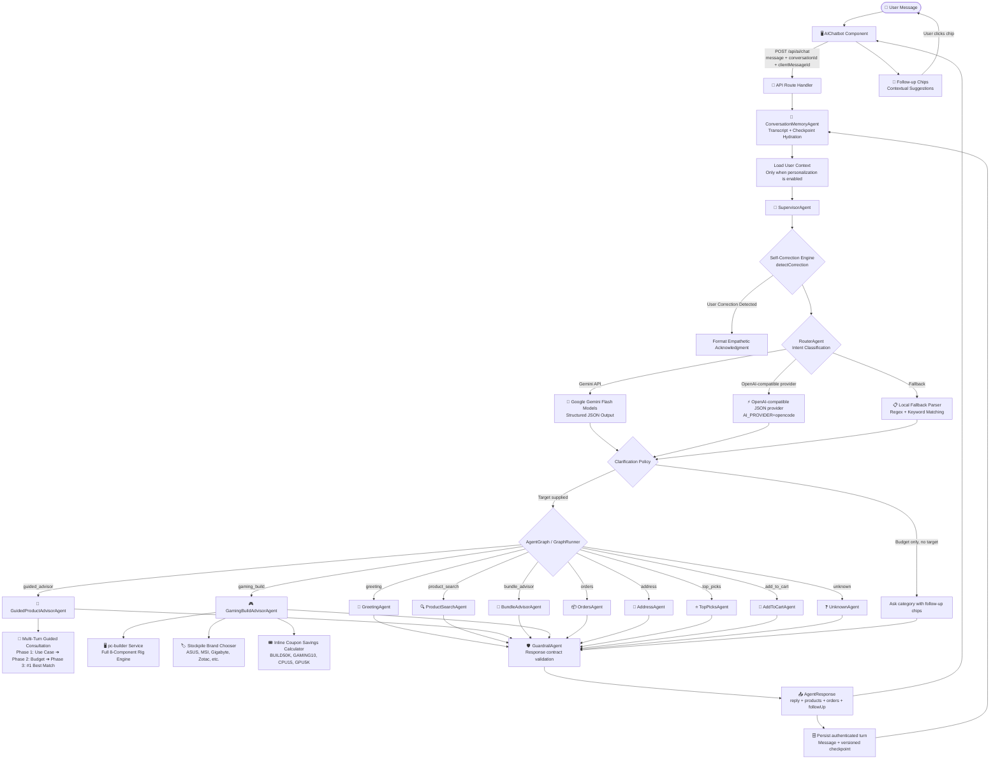
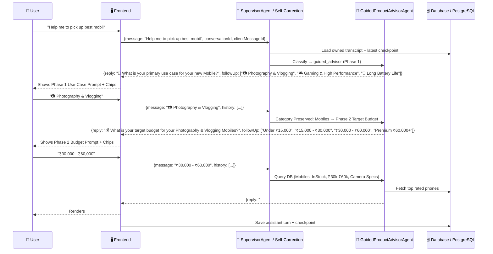

# 🤖 Agentic AI Architecture — ShopNow E-Commerce

## Overview

ShopNow implements a **supervisor-driven, graph-style multi-agent conversational AI** system that provides responsible, multi-turn shopping assistance. The system features an **authenticated conversation memory and checkpoint agent**, **Adaptive Self-Correction & Error Recovery**, a **Multi-Turn Guided Product Advisor Engine** for electronics categories, a pluggable model-provider layer for intent classification, a supervisor for orchestration and fault-tolerant fallbacks, and a deterministic PC Builder engine supporting compatible gaming rigs.

---

## System Flow



---

## Multi-Turn Conversation & Self-Correction Flow



---

## Agent Architecture

### Directory Structure

```
artifacts/api-server/src/agents/
├── index.ts                       # Barrel exports
├── types.ts                       # Shared interfaces
├── supervisor-agent.ts            # 🧠 Orchestrates agent workflow + fault-tolerant recovery
├── conversation-memory-agent.ts   # 🧠 Authenticated transcript and checkpoint persistence
├── self-correction-engine.ts      # 💡 Detects user corrections & generates empathetic self-correcting prefixes
├── router-agent.ts                # Intent classification + active conversation persistence
├── guided-product-advisor-agent.ts# 📱 3-Phase Multi-Turn Guided Advisor for Mobiles, Laptops, Audio, Cameras
├── clarification-policy.ts        # Stops vague budget-only catalog searches
├── gaming-build-advisor-agent.ts    # 🎮 8-Component PC Build advisor, brand chooser & inline coupon calculator
├── agent-graph.ts                 # Specialist nodes and intent edges
├── graph-runner.ts                # Executes the selected graph path
├── guardrail-agent.ts             # Validates final frontend response contract
├── user-context.ts                # Loads user profile from DB
├── greeting-agent.ts              # 👋 Welcome + personalization
├── product-search-agent.ts        # 🔍 Cascading product search with keyword intelligence
├── bundle-advisor-agent.ts        # 🎁 Profession-based bundle recommendations
├── top-picks-agent.ts             # ⭐ History-based recommendations
├── orders-agent.ts                # 📦 Order history (login-gated)
├── address-agent.ts               # 📍 Shipping address (login-gated)
├── add-to-cart-agent.ts           # 🛒 Single + bulk add via conversation
└── unknown-agent.ts               # ❓ Fallback + suggestions
```

Conversation persistence is defined in `lib/db/src/schema/conversations.ts`:

- `chat_conversations` stores the authenticated owner and personalization setting.
- `chat_messages` stores ordered user/assistant turns and retry IDs.
- `chat_checkpoints` stores versioned advisor state for guided-flow recovery.

---

## Core Agent Capabilities

### 📱 Guided Product Advisor Engine (`guided-product-advisor-agent.ts`)

- **Multi-Category Guided Consultation**: Supports **Mobiles**, **Laptops**, **Audio/Headphones**, **Cameras**, **TV & Smart Displays**, **Tablets**, and **Accessories**.
- **Phase-by-Phase Interactive Questioning**:
  - **Phase 1 (Primary Use Case)**: e.g. `📷 Photography & Vlogging`, `🎮 Gaming & High Performance`, `🔋 Long Battery Life`, `💼 Business & Office Work`, `🎬 Movies & Streaming` (TVs), `🎨 Digital Art & Drawing` (Tablets).
  - **Phase 2 (Target Budget & Brand Filters)**: e.g. `Under ₹15,000`, `₹15,000 - ₹30,000`, `₹30,000 - ₹60,000`, `Premium ₹60,000+`.
  - **Phase 3 (Precision Match & #1 Single Best Product)**: Ranks products by ratings & use-case specifications, presenting the **#1 Single Best Match** with an itemized recommendation rationale and top alternatives.
- **Out-of-Catalog Category Redirects**: TV and Tablet queries present friendly alternative guidance (Monitors, Laptops, Audio) instead of breaking.
- **Context Preservation**: Retains category and user choices across multi-turn chip selections without getting hijacked.

### 💡 Self-Correction & Error Recovery Engine (`self-correction-engine.ts`)

- **User Correction Detection**: Scans user input for correction patterns (`"no I meant"`, `"that's not what I asked"`, `"I already said"`, `"you misunderstood"`, `"wrong brand"`).
- **Empathy & Learning**: Generates natural, apologetic acknowledgment prefixes (`"💡 Understood! My apologies for the brand mixup. I've updated the brand filter for you:"`).
- **Empty Response Guard (`supervisor-agent.ts`)**: Scans downstream agent outputs. If an agent returns 0 products or a blank response, the Supervisor injects contextual recovery guidance and rescue chips.
- **Fault Tolerance**: Wraps graph execution in `try-catch` blocks. If downstream API calls or LLM services fail, `SupervisorAgent` triggers a self-healing fallback response instead of breaking the chat.

### 🎮 Human-Style Store Advisor PC Builder (`gaming-build-advisor-agent.ts` & `pc-builder.ts`)

- **5-Step Human Store Advisor Conversation Flow**:
  1. 💰 **Budget Selection**: Target total budget (`₹60,000`, `₹1,00,000`, `1.5 lakh`, `₹2,50,000`, `₹3,00,000`).
  2. 🎯 **Use Case / Workload**: `🎮 Pure Gaming & Esports`, `🎬 Video Editing & Content Creation`, `📡 Live Streaming & Gaming`, `💼 Heavy Workstation & CAD`.
  3. 🔵🔴 **Processor (CPU) Brand**: `🔵 Intel`, `🔴 AMD Ryzen`, `🤖 Let AI decide — best value for budget`.
  4. 🟢🔴 **Graphics Card (GPU) Brand**: `🟢 Nvidia RTX`, `🔴 AMD Radeon`, `🤖 Let AI decide — best FPS/₹`.
  5. 📺 **Target Monitor Resolution**: `⚡ 1080p High FPS (Esports)`, `🎯 1440p QHD High-Refresh`, `🌟 4K Ultra Gaming`, `🖥️ Multi-Monitor Workstation`.
- **Full 8-Component Rigs**: Recommends complete, compatible hardware configurations across **Processor**, **CPU Cooler**, **Graphics Card**, **RAM**, **Storage**, **Power Supply**, **Motherboard** (404 items in catalog), and **Case / Cabinet** (629 items in catalog).
- **Decimal & Multi-Format Budget Parser**: Converts inputs like `1.5 lakh`, `1.5L`, `150k`, `₹1,50,000`, `1.5` to ₹150,000.
- **Stockpile Brand Chooser**: Dynamically queries live in-stock brands (`ASUS`, `MSI`, `Gigabyte`, `Zotac`, `Corsair`, `Lian Li`, `NZXT`) and handles unstocked requests by providing a 1-tap brand discovery menu.
- **Inline Coupon Calculator**: Calculates exact promo code savings directly inside the PC build flow (`BUILD50K`, `GAMING10`, `CPU15`, `GPU5K`).
- **Post-Build Interactive Swaps**: Supports instant commands like `"Swap GPU to Nvidia"`, `"Swap CPU to Intel"`, `"Show cheaper build"`, `"Upgrade build"`.

### 🧭 Intent-Aware Router Agent (`router-agent.ts`)

- **Fast-Path Pattern Routing**:
  - `Compare`: Detects `vs`, `versus`, `compare X with Y` → direct comparison intent.
  - `Returns/Refunds`: Detects return/exchange requests → routes to `orders` agent with return instructions.
  - `Deals & Offers`: Routes flash sales and coupon requests to `popular_products`.
  - `PC Building vs Generic Gaming`: Strictly separates `"pc build"` / `"build a gaming pc"` from generic `"gaming laptops"` or `"gaming headset"`.
  - `Active Conversation Persistence`: Preserves ongoing multi-turn advisor sessions across CPU/GPU brand questions, budget steps, and confirmation flows.

### ❓ Dynamic Intent-Rescue Fallback (`unknown-agent.ts`)

- Analyzes unmatched messages to surface category-specific rescue chips (e.g. Return/Refund steps, Warranty info, Compare syntax, or TV/Tablet alternative redirects) instead of generic dead-ends.

### 📦 Order Tracking & Return Management (`orders-agent.ts`)

- **Order ID Extraction**: Automatically extracts `"order 123"` or `"order #45"` to fetch and format single order details.
- **Native Returns Handling**: Detects return/refund requests and lists delivered orders eligible for return with step-by-step guidance.

---

## 🧾 Order Details & Tax Invoice System (`/order/:id`, `/orders/:id`)

- **Line-Item Snapshots**: Joined `orderItemsTable` with `productsTable` returning product name, brand, category, thumbnail image, unit price, and quantity.
- **Live Shipment Stepper**: 4-stage tracking pipeline (`Order Placed` ➔ `Confirmed` ➔ `Shipped` ➔ `Delivered`).
- **Authoritative Financial Breakdown**: Displays Subtotal, Product Markdowns, **Applied Coupon Code Badge & Savings Snapshot**, Free Shipping, and Total Paid.
- **1-Click Printable Tax Invoice**: Modal generating a clean, printable tax invoice (`#INV-5`) with full billing info.

---

## Security & Safety

- **Login gates**: Orders, Address, AddToCart require authentication
- **Session isolation**: Cart uses `user_{id}` or `default` session IDs
- **Input validation**: Message required, history capped at 8 entries
- **Provider fallback**: Works seamlessly without an API key using the local regex/keyword parser
- **No PII in logs**: Only intent name + agent name logged
- **Non-electronics guardrail**: Gracefully blocks out-of-domain requests

## Current Memory and Responsible AI Additions

The current implementation extends the original graph with authenticated conversation memory:

1. `POST /api/ai/chat` accepts `conversationId`, `clientMessageId`, and an explicit personalization choice.
2. `ConversationMemoryAgent` restores the owned transcript and latest checkpoint before supervision.
3. Successful turns persist ordered messages and a versioned checkpoint.
4. Duplicate client message IDs replay the stored response safely.
5. `GET` and `DELETE /api/ai/conversations/:conversationId` provide owned resume and deletion controls.
6. Anonymous chats remain browser-session-only and never load order-history context.

The Responsible AI layer now requires catalog-grounded, in-stock recommendations with visible reasons. Search explanations identify category, budget, and availability filters. Popularity results disclose their review/rating basis and distinguish popularity from personal fit. JWT validation rejects bare IDs and invalid signatures, while authenticated chat requires a client message ID for retry safety.

### Updated PC Advisor Flow

The PC advisor is goal-first for natural shopping requests such as “build a PC for my son”: recipient task, usage intensity, budget, then optional technical refinement. CPU and GPU choices are automatically selected from compatible in-stock inventory unless the shopper explicitly requests a brand or component preference.

### Confirmed Cart Handoff

Suggested product rows require confirmation before mutation. **Add & view cart** adds the product, clears the authenticated conversation or anonymous session memory, and redirects the shopper to `/cart`. Cancelling leaves the search and checkpoint intact.

For the detailed implementation and QA checklist, see [AI-CHATBOT-MEMORY-GUARDRAILS.md](AI-CHATBOT-MEMORY-GUARDRAILS.md).
